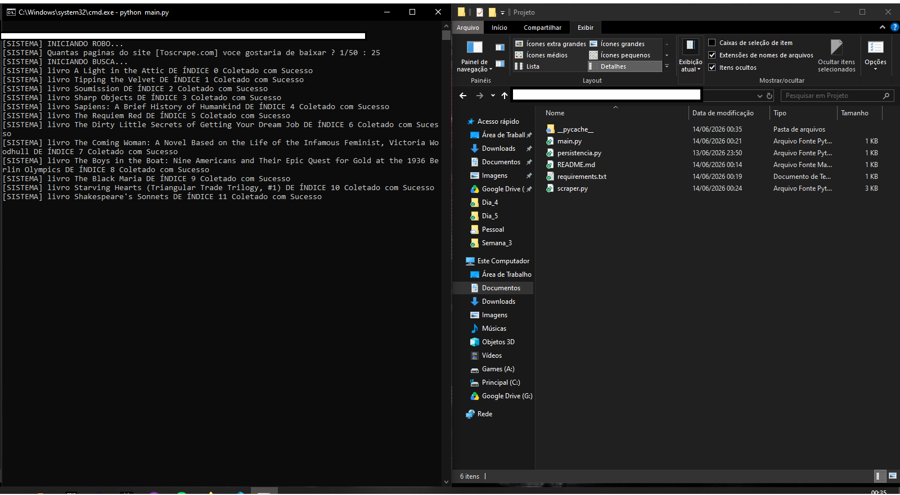
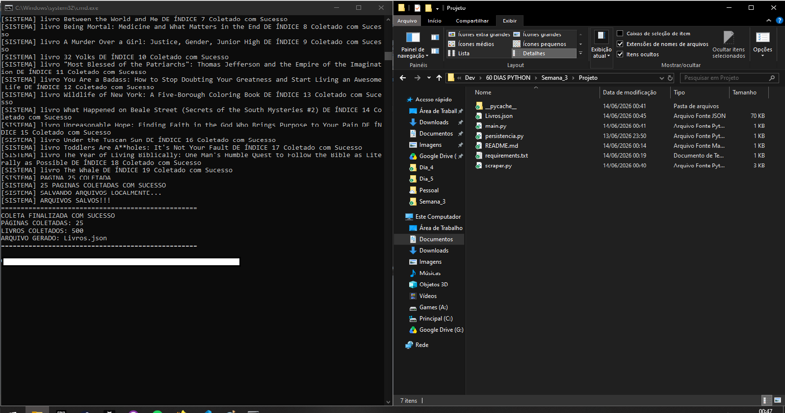
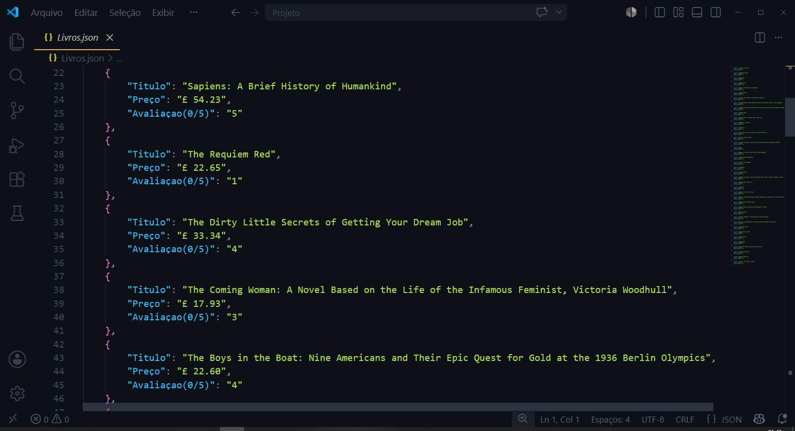

# 📚 Book Scraper

Projeto desenvolvido em Python para coleta automatizada de dados do site BooksToScrape, realizando paginação dinâmica, extração de informações dos livros e exportação dos resultados para um arquivo JSON.

## Objetivo

Praticar conceitos de Web Scraping utilizando Requests e BeautifulSoup, incluindo paginação, tratamento de erros, organização modular do código e persistência de dados em JSON.

## Funcionalidades

- Coleta de até 50 páginas
- Extração de título dos livros
- Extração de preço
- Extração de avaliação
- Exportação dos dados para JSON
- Tratamento básico de falhas de rede
- Paginação automática

## Tecnologias

- Python
- Requests
- BeautifulSoup4
- JSON

## Estrutura do Projeto

```text
Projeto/
│
├── imagens/
│   ├── execucao_scraper.png
│   └── resultado_scraper.png
│
├── main.py
├── scraper.py
├── persistencia.py
├── requirements.txt
├── README.md
└── .gitignore
```

## Execução



## Resultado



## Resultado em JSON



## Como Executar

```bash
pip install -r requirements.txt
python main.py
```

## Exemplo de Saída

```text
============================================

COLETA FINALIZADA COM SUCESSO

PÁGINAS COLETADAS: 25
LIVROS COLETADOS: 500
ARQUIVO GERADO: Livros.json

============================================
```